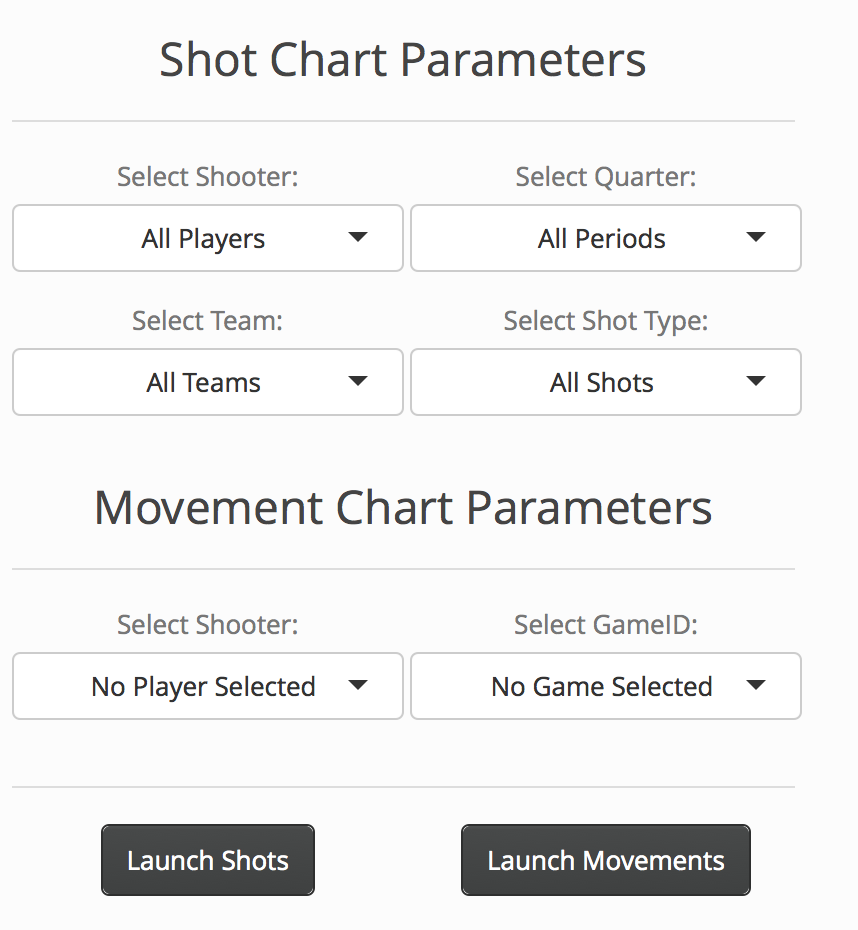
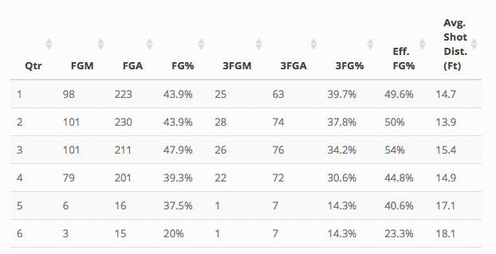
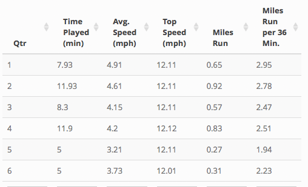

##### Last Updated: March 21, 2017

SportVU is a system of six cameras hung from the rafters of sports arenas that collects real-time positioning of the players and the ball at a rate of 25 times per second. In the beginning of the 2013 NBA season, SportVU partnered with the NBA to install these cameras in every arena to provide further insight on player and ball movement.

However, working with the data from scratch is burdensome. Each game contains nearly 800,000 datapoints on player/ball locations, and coding the scripts to parse the data is an hours-long process. The SportVU R package helps users easily parse, analyze, and visualize SportsVU data.


### Getting Started
We can use the *masterParse* function on a directory containing NBA SportVU XML files to parse it. Upon parsing the files, we may split the data into the three main dataframes: the sportVU dataframe containing the x/y coordinates of all of the players, the shots dataframe containing information about the shots that the players took, and the rosters dataframe that we use for merging purposes. We can do this by calling the functions *setSportVU*, *setShots*, and *setRosters*, respectively.

Note: the commented out lines represent an example of how one can proceed. We will use the sample dataframes (more on this below) to demonstrate.

```{r}
library(sportVU)
```
```{r, eval = FALSE}
parse_df <- masterParse('YOUR_DIRECTORY_OF_NBA_SPORTVU_SAMPLE_FILES')
setShots(parse_df$shots)
setSportVU(parse_df$sportvu)
setRosters(parse_df$rosters)
runShotChart()
```


### Sample Data
NBA SportVU data isn't publicly widely available (all teams have full access to data), but samples are available online. Our package includes a sample of five complete NBA games in January and February 2016. Included are the corresponding data frames of rosters, shots, and sportvu (named test_rosters, test_shots, and test_sportvu, respectively).

The *test_rosters* dataframe is a sample of the rosters file. It includes the names of the players, which position(s) they play, their player IDs, and which team and team ID that they player is on.
```{r}
head(test_rosters, 1)
```

The *test_shots* dataframe includes the shots taken by all of the players in the 5 games in the dataset. It includes the player IDs of the shooter, the location and time of the shot, whether the shot was a 3-pointer, if any dribbles were taken before the shot, the distance of the shot from the rim, and whether the shot was made or missed.
```{r}
head(test_shots, 1)
```

The *test_sportVU* dataframe is a sample of the sportVU file, which contains the bulk of the data with all of the x/y coordinates of the players. It includes the time of the game and shot clock, the team/game/player IDs, and the location of the player.
```{r}
head(test_sportvu, 1)
```


### Examples of Use of Data
We can use the data to find out simple shot-related questions. Let's say we want to know what the average shot distance was for Kobe Bryant. To do that, we can merge test_rosters with test_shots to find out:

```{r}
df_shots = merge(test_shots, test_rosters[, names(test_rosters) %in% c("global.player.id", "player", "team.name")],
                by = "global.player.id")
mean(df_shots$shot.distance[df_shots$player == 'Kobe Bryant'])
```

We can see that Kobe Bryant shot the ball an average of 19.2 feet away from the basket.

We can also use the SportVU dataframe to gather insights about a player's movements. We can, for example, use a player's x and y coordinates to calculate their average and top speeds. Let's take a deeper look into Jeremy Lin's speeds on the court:

```{r}
df_sportvu = merge(test_sportvu, test_rosters[, names(test_rosters) %in% c("global.player.id", "player", "team.name")], by = "global.player.id")
df_sportvu = df_sportvu[order(df_sportvu$order), ]
```

To do this, we can write a function that calculates a player's velocities..

```{r}
velocity <- function(xloc, yloc) {
  diffx <- as.vector((diff(xloc)))
  diffy <- as.vector((diff(yloc)))
  diffx_sq <- diffx ^ 2
  diffy_sq <- diffy ^ 2
  a <- sqrt(diffx_sq + diffy_sq)
  b <- a * 25 * 0.681818  # convert to miles per hour
  b <- c(0, b)
  b }
```

Then, we can finally do the calculations.

```{r}
df_sportvu.jeremy <- df_sportvu[df_sportvu$player == 'Jeremy Lin', ]
df_sportvu.jeremy$velocity <- velocity(df_sportvu.jeremy$x_loc, df_sportvu.jeremy$y_loc)
df_sportvu.jeremy <- df_sportvu.jeremy[df_sportvu.jeremy$vel <= quantile(df_sportvu.jeremy$vel, 0.99), ]
```

We do the above to get rid of the datapoints in which the player changed positions on the court due to game stoppage situations, where in the data, it might seem like the player teleported from one location on the court to another, skewing the data. 

```{r}
summary(df_sportvu.jeremy$velocity)
```
Jeremy Lin runs at an average of 4.3 mph on the court and his top speed was 12.1 mph.


### Shiny App
Most importantly, we have created a Shiny app in which users can toggle which players/teams that they may want to examine. The app returns either a shot chart noting a player's shot tendencies and efficiency, or a movement chart which returns the locations of players. The app also returns a summary table of a player's movements or shots depending on which chart is displayed.

You can open up the RShiny app by typing in the command *runShotChart()*

There are multiple toggles to filter out what you might want.



Under "Shot Chart Parameters," we have toggles for a shot chart. Here, you can select a shooter or a team (note: if both a shooter and team are selected, then the shot chart will default to the player selected). You can also filter by quarter, and by the type of shot - "Off the Dribble"" refers to shots taken with a dribble before the shot, while "Pull Up" refers to shots that had no dribbles before the shot was taken.

After selecting a player, we can see a player's shot chart. The bigger the dot, the more shots that the team took at that location of the floor. The closer to red the dot is, the higher the efficiency of the shot. The closer to blue the dot on the shot chart is, the lower the efficiency of the shot. We see below that the Kings are more efficient closer to the basket, and on the right corner three, and not efficient in the other three-point locations.


Under "Movement Chart Parameters," we have toggles for selecting the player whose movement plots you want to see, as well as the game ID. If no game ID is selected, then movement tables/charts for all games that the player played in the data is shown.

We see below that the Kings center Demarcus Cousins is a player who tends to be positioned closer to the basket.


Every time a shot chart or movement chart is requested, there is an accompanying summary table on the lower left-hand corner of the app. These tables are grouped by each quarter the player plays. 

For the shot charts, the summary table includes field goals made, field goals attempted, field goal percentage, 3-pointers made, 3-pointers attempted, 3-point field goal percentage, an effective field goal percentage that gives a bonus for making 3-pointers, and an average shot distance. 



For the movement plots, the summary table includes time played, a player's average speed, their top speed, the number of miles run, and the number of miles run per 36 minutes to standardize.


